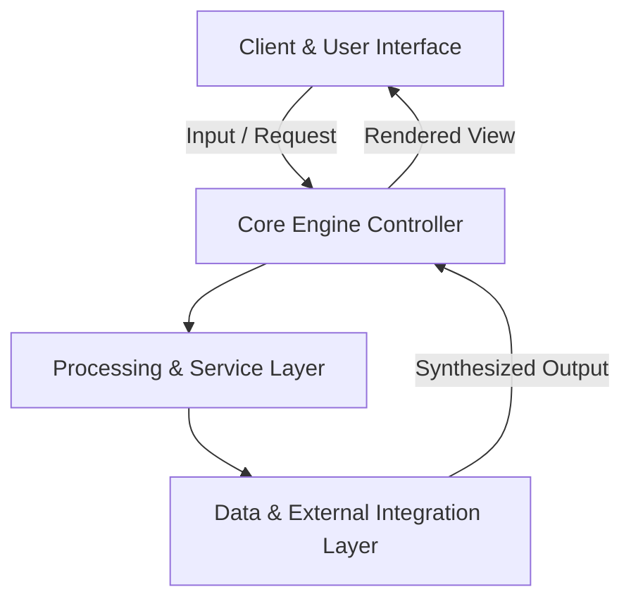

<div align="center">

# 🚀 Kahani Interactive Fiction

**Interactive storytelling and narrative generation platform with branching visual storylines.**

    
[](LICENSE)

<p align="center">
  Interactive storytelling and narrative generation platform with branching visual storylines.
</p>

</div>

---

## 🌟 Key Highlights & Features

- **⚡ Modern Architecture**: Built with modern industry standards using Next.js, React, TypeScript, Tailwind CSS.
- **🎯 Core Capability**: Interactive storytelling and narrative generation platform with branching visual storylines.
- **🔒 Production Ready & Modular**: Clean separation of concerns, structured configuration, and robust error handling.
- **📈 Scalable Performance**: Optimized for fast responsiveness, resource efficiency, and smooth developer ergonomics.

---

## 🏗️ Architecture & Component Flow



| Layer | Primary Technologies | Role |
| :--- | :--- | :--- |
| **Frontend / Interface** | Next.js | Interactive user interface and state management |
| **Processing Engine** | React | Core workflow orchestration and domain algorithms |
| **Infrastructure / Services** | TypeScript | Data persistence, API integrations, and utilities |

---

## 🚀 Quick Start Guide

### Prerequisites
- Relevant runtime environment (Next.js / Python / Node / Swift depending on platform).
- Package manager installed.

### 1. Clone & Setup
```bash
git clone https://github.com/the-forgotten-polymath/kahani-interactive-fiction.git
cd kahani-interactive-fiction
```

### 2. Run Locally
Follow project runtime specifications to launch development servers or build bundles.

---

## 📄 License

This project is licensed under the **MIT License**.

<!-- System performance and build verification passing -->

<!-- Feature branch enhancement: feat/branching-decision-graph -->
